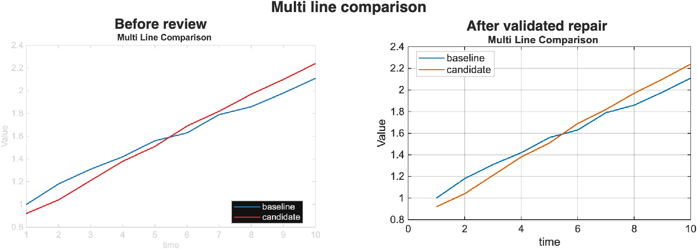

# MATLAB Plotting Skill

[English](README.md) | [简体中文](README.zh-CN.md)

This repository now carries two small research skills. The first, and still the
main one, is for the part of MATLAB plotting that usually gets messy:
looking at a table or matrix, deciding which MATLAB figure is a sensible first
try, rendering it through MATLAB CLI, and leaving a report that explains the
choice.

The second is `scientific-diagram-skill`, a companion skill for Mermaid and
draw.io / diagrams.net research diagrams. It covers method flows, system block
diagrams, signal chains, experiment pipelines, and editable diagram handoff.
That work is kept separate from MATLAB plotting because diagrams and numeric
figures have different review risks.

The skill is self-contained. It does not depend on private archives, local
template folders, or another plotting repository. If MATLAB is available, it can
render. If MATLAB is not available yet, the metadata commands still let you
inspect the catalog and plan the next step.

## Project Ecosystem

This skill is the agent-facing layer in a small MATLAB scientific-figure
ecosystem:

- [`matlab-scientific-figures`](https://github.com/Kkkakania/matlab-scientific-figures)
  is the main clean-room MATLAB gallery and template reference.
- [`matlab-figure-ci`](https://github.com/Kkkakania/matlab-figure-ci) provides
  CI/CLI checks for gallery outputs, provenance, privacy, and release readiness.
- [`matlab-plotting-skill`](https://github.com/Kkkakania/matlab-plotting-skill)
  helps agents choose and render suitable MATLAB figures from user data. It also
  includes `scientific-diagram-skill` for clean Mermaid and draw.io research
  diagrams.
- [`python-plotting-skill`](https://github.com/Kkkakania/python-plotting-skill)
  is the Python sibling for small Matplotlib-based scientific plotting tasks.
- [`scientific-plotting-function-library`](https://github.com/Kkkakania/scientific-plotting-function-library)
  is a larger Python + MATLAB reference library for template taxonomy,
  palette names, and stricter large-gallery release checks.

This skill deliberately keeps a curated core instead of mirroring every
available plotting resource. A scheme belongs here only when the agent can
inspect the data, choose the chart, render it through MATLAB CLI, and explain
the result without exposing private material. See
[`docs/curated-core-policy.md`](docs/curated-core-policy.md).

Local course folders or legacy plotting collections can be useful for spotting
missing chart tasks. They are not treated as source material. The public skill
does not copy private templates, paper figures, binary project files,
watermarks, or author-marked code. See
[`docs/local-resource-intake.md`](docs/local-resource-intake.md).

I keep this boundary strict because the skill is meant to be installed into
other people's agent runtimes. It should explain its choices from public code
and synthetic examples, not from a private folder the user cannot inspect.

The ecosystem handoff contract is documented in
[`docs/ecosystem-status.md`](docs/ecosystem-status.md): this repository hands
off `render_report.md/json` and exported figures, `matlab-figure-ci` reviews
those artifacts, and reusable gallery work moves into `matlab-scientific-figures`
only after a clean-room rewrite.

This repository also dogfoods that handoff with a small `mfigci.yml`. The public
workflow runs:

```bash
mfigci check --config mfigci.yml --report mfigci-report.md
```

The check covers committed gallery previews, privacy/provenance rules, and risky
file extensions. It does not run MATLAB on GitHub-hosted runners. The workflow
uploads `mfigci-report.md` and `.mfigci-results.json`: the Markdown file is for
quick maintainer review, while the JSON file keeps the same result available for
later evidence packets or debugging.

## What It Does

`matlab-plotting-skill`:

- Reads CSV, Excel, or MAT data.
- Infers the data shape and the user's plotting goal.
- Selects one of 51 plotting schemes.
- Renders the figure with clean-room MATLAB code bundled in the skill.
- Exports PNG and SVG by default, with optional PDF.
- Writes Markdown and JSON render reports explaining the selected scheme and alternatives.
- Includes concrete selection signals in reports so automatic choices are easier to audit.
- Includes a score snapshot for the top scheme candidates.

### Candidate review and evidence bundle

The optional review workflow extends a single render into a checked candidate
comparison:

```text
data + goal -> ranked MATLAB candidates -> validated review
            -> validated repair allowlist -> final figure + before/after evidence
            -> offline HTML report + SHA-256 integrity manifest
```

The important behavior is semantic as well as visual. In the bundled demo, a
rule-ranked confidence band is rejected because the source columns are two
methods, not lower and upper uncertainty bounds. The workflow selects the
honest multi-line comparison, applies controlled contrast and typography
repairs, and records why it changed.



Run the complete synthetic-data demo:

```bash
MATLAB_BIN=/Applications/MATLAB_R2025a.app/bin/matlab \
  ./scripts/run_review_demo.sh --out /tmp/matlab-plot-review-demo
```

The demo now finishes with `review_report.html`, a self-contained HTML review
surface that embeds the rendered candidates, decision, scores, findings,
before/after comparison, and artifact hashes without network dependencies. The
companion `review_bundle_manifest.json` records every source artifact with its
byte count and SHA-256 digest. Verify a copied or downloaded bundle with:

```bash
python3 scripts/verify_review_bundle.py \
  --manifest /tmp/matlab-plot-review-demo/review_bundle_manifest.json \
  --root /tmp/matlab-plot-review-demo
```

The bundle builder rejects absolute paths, path traversal, missing candidate
files, unsupported previews, malformed scores, and unescaped model-authored
text before writing the report.

The review-to-MATLAB boundary also has a reproducible adversarial benchmark. A
valid checked review is accepted, while 14 mutations covering executable-action
injection, candidate/model spoofing, field smuggling, malformed scores, and
contradictory verdicts must fail closed. The committed result is
**15/15 checks passed**:

```bash
./scripts/run_review_contract_benchmark.py \
  --validator scripts/validate_plot_review.py \
  --manifest examples/review/multi_series_manifest.json \
  --review examples/review/multi_series_review.json \
  --out /tmp/plot-review-contract-benchmark
```

See the [human-readable benchmark report](docs/build-week/review-contract-benchmark/review_contract_benchmark.md)
and its [machine-readable evidence](docs/build-week/review-contract-benchmark/review_contract_benchmark.json).

The implementation history and event boundary remain in
[`docs/build-week-2026.md`](docs/build-week-2026.md). See
[`review-contract.md`](skills/matlab-plotting-skill/references/review-contract.md)
for the checked review schema. The repository commits only the key comparison
figure; candidates, the offline report, and evidence are regenerated from
bundled synthetic data.

`scientific-diagram-skill`:

- Drafts research diagrams in Mermaid before committing to a layout.
- Guides editable `.drawio` source for diagrams.net / draw.io.
- Reviews method flows, system diagrams, signal chains, experiment pipelines,
  and agent workflow diagrams.
- Keeps diagram provenance separate from data plots, with no watermarks,
  private logos, paper-figure tracing, local paths, or hidden author marks.
- Includes a checked example pair,
  `skills/scientific-diagram-skill/assets/examples/research-method-flow.drawio`
  and `research-method-flow.svg`, plus provenance notes and `manifest.json`.
  Maintainers can run `python3 scripts/check_diagram_examples.py` before
  changing the example.

## Preview

All previews below are generated from bundled synthetic data.
The generated preview index is in `docs/gallery/index.md`, and preview
provenance is tracked in `docs/gallery/provenance.md`.
Current support status is tracked in `docs/scheme-readiness.md`, which separates
the 51-scheme catalog from gallery-backed and still-maturing schemes.

| Trend | Multi-Line | Confidence Band |
|---|---|---|
|  |  |  |

| Zoomed Inset | Scatter | Density Scatter |
|---|---|---|
|  |  |  |

| Grouped Scatter | Contour Scatter | Regression Scatter |
|---|---|---|
|  |  |  |

| Heatmap | Grouped Bar | Positive/Negative Area |
|---|---|---|
|  |  |  |

| Segmented Line | Stacked Time Series |
|---|---|
|  |  |

## Install

Install the skill folder into the agent runtime you use. Codex remains the
default target, and Claude Code or project-local directories are supported with
explicit flags:

```bash
./scripts/install_skill.sh
./scripts/install_skill.sh --target claude-code
./scripts/install_skill.sh --target dir --path ./skills
./scripts/install_skill.sh --skill scientific-diagram-skill --target dir --path ./skills
```

Preview the install target first:

```bash
./scripts/install_skill.sh --target claude-code --dry-run
```

See [`docs/install-targets.md`](docs/install-targets.md) for target paths,
copy-vs-symlink behavior, and verification commands.

Then ask your agent for tasks such as:

```text
Use my CSV to make the best MATLAB figure for comparing methods.
Render a correlation figure from this Excel sheet.
Choose a plot for this MAT file and export PNG/SVG.
Sketch my method as Mermaid, then make an editable draw.io diagram.
Review this experiment pipeline diagram before I put it in the README.
```

For a first hands-on pass, follow
[`docs/first-render-walkthrough.md`](docs/first-render-walkthrough.md). It
walks through MATLAB setup, data inspection, `--plan-only`, rendering, and
post-render checks with one bundled CSV.

Fresh-clone feedback is most useful when it includes the MATLAB version,
commands run, a short data-shape summary, selected scheme, report summary, and
any redacted failure output. Use the
[first-use feedback issue template](https://github.com/Kkkakania/matlab-plotting-skill/issues/new?template=first_use_feedback.yml)
for that path instead of pasting private data files or local path dumps.
Before rendering, `./scripts/doctor.sh --out <diagnostic-dir>` can run a
metadata-only checkout diagnostic and write `first_use_doctor.md/json`. The
same diagnostic is also available through the main CLI:
`./scripts/render_with_matlab.sh --doctor --out <diagnostic-dir>`.
After a render, `./scripts/collect_first_use_feedback.sh --out <render-output>`
can generate a redacted Markdown draft for that issue. Pass
`--doctor <diagnostic-dir>` too when you have a doctor report, and
`--data-shape "<rows/columns/role summary>"` when `--inspect-data` produced a
useful structure summary.
If something fails before a useful report appears, start with
[`docs/troubleshooting.md`](docs/troubleshooting.md).

## First 5 Minutes

Use this narrow path on a fresh clone before trying private data:

1. Check the catalog without MATLAB.

   ```bash
   ./scripts/doctor.sh --out /tmp/matlab-plotting-skill-doctor
   ./scripts/render_with_matlab.sh --doctor --out /tmp/matlab-plotting-skill-doctor
   ./scripts/render_with_matlab.sh --list-schemes
   ./scripts/render_with_matlab.sh --list-schemes --status
   ./scripts/render_with_matlab.sh --scheme-info line_trend
   ```

2. Confirm MATLAB is callable.

   ```bash
   MATLAB_BIN=/Applications/MATLAB_R2025a.app/bin/matlab ./scripts/render_with_matlab.sh --check
   ```

3. Inspect and plan with the bundled CSV.

   ```bash
   MATLAB_BIN=/Applications/MATLAB_R2025a.app/bin/matlab ./scripts/render_with_matlab.sh --inspect-data --data examples/data/time_series.csv
   MATLAB_BIN=/Applications/MATLAB_R2025a.app/bin/matlab ./scripts/render_with_matlab.sh --plan-only --data examples/data/time_series.csv --goal "show a time trend"
   ```

4. Render into a scratch directory.

   ```bash
   MATLAB_BIN=/Applications/MATLAB_R2025a.app/bin/matlab ./scripts/render_with_matlab.sh --data examples/data/time_series.csv --goal "show a time trend" --out /tmp/matlab-plotting-skill-first-render --formats png,svg
   ```

SFT_OUTPUT_DIR is not used by this repository; pass `--out <directory>` to
choose the render location.

The same sequence is available as a shareable
[`docs/first-five-minutes.md`](docs/first-five-minutes.md) guide, including
additional bundled fixtures such as `multi_series.csv`, `confidence_band.csv`,
and `method_scores.csv`.

## CLI

### Try Metadata First

Use these commands before configuring MATLAB:

```bash
./scripts/render_with_matlab.sh --list-schemes
./scripts/render_with_matlab.sh --list-schemes --status
./scripts/render_with_matlab.sh --list-schemes-json --status
./scripts/render_with_matlab.sh --scheme-info line_trend
./scripts/render_with_matlab.sh --scheme-info line_trend --status
./scripts/render_with_matlab.sh --scheme-info-json line_trend
./scripts/render_with_matlab.sh --scheme-info-json line_trend --status
```

These commands do not render figures. They help confirm that the repository,
skill catalog, and shell wrapper are working before you point the workflow at a
MATLAB executable.

Set MATLAB if it is not already on `PATH`:

```bash
export MATLAB_BIN=/Applications/MATLAB_R2025a.app/bin/matlab
./scripts/render_with_matlab.sh --check
```

On Windows Git Bash, include the `.exe` suffix and quote the `Program Files`
path:

```bash
MATLAB_BIN="/c/Program Files/MATLAB/R2024b/bin/matlab.exe" ./scripts/render_with_matlab.sh --check
```

MATLAB-backed commands use a 600-second timeout by default. `--smoke-test`
auto-scales that budget from the number of catalog schemes
(`MP_MATLAB_COLD_START_BUDGET_SECONDS + MP_PER_SCHEME_BUDGET_SECONDS * N`) and
treats `MP_MATLAB_TIMEOUT_SECONDS` as a floor. Set
`MP_MATLAB_TIMEOUT_SECONDS=0` to disable the guard for a deliberate long local
render, or set a smaller value when testing CI behavior on non-smoke commands.

Some commands are metadata-only and can be used before MATLAB is configured.
Commands that inspect data, plan a figure, smoke-test schemes, or render output
call MATLAB because the data loading and selection logic lives in the bundled
MATLAB code.

| Works without MATLAB | Requires MATLAB |
|---|---|
| `--list-schemes` | `--check` |
| `--list-schemes-json` | `--inspect-data --data <file>` |
| `--scheme-info <name>` | `--plan-only --data <file> --goal "<text>"` |
| `--scheme-info-json <name>` | `--smoke-test` |
|  | full rendering with `--data`, `--goal`, and `--out` |

Render from data:

```bash
./scripts/render_with_matlab.sh --data examples/data/time_series.csv --goal "show a time trend" --out figures --formats png,svg
```

`--formats` accepts a comma-separated list containing `png`, `svg`, and `pdf`.
Invalid entries fail before MATLAB starts.

Inspect data schema without selecting or rendering:

```bash
./scripts/render_with_matlab.sh --inspect-data --data examples/data/time_series.csv
```

The JSON includes `RoleHint` and `NextCommandHint` so a first-time user can see
what the data resembles and which `--plan-only` command to try next without
leaking an absolute local path.

Preview the selected scheme without rendering:

```bash
./scripts/render_with_matlab.sh --plan-only --data examples/data/time_series.csv --goal "show a time trend"
```

Explain the selected scheme in terminal-friendly language:

```bash
./scripts/render_with_matlab.sh --explain --data examples/data/time_series.csv --goal "show a time trend"
```

Render with an explicit scheme:

```bash
./scripts/render_with_matlab.sh --list-schemes
./scripts/render_with_matlab.sh --list-schemes-json
./scripts/render_with_matlab.sh --scheme-info line_trend
./scripts/render_with_matlab.sh --scheme-info-json line_trend
./scripts/render_with_matlab.sh --data examples/data/method_scores.csv --scheme grouped_bar --out figures --formats png,svg
```

Use `--scheme` to bypass planning when you already know the chart family. If
you want the skill to choose, use `--goal` without `--scheme`.

The JSON catalog commands keep the existing array/item shape and include a
`schema_version` field on each record so downstream scripts can detect future
format changes without brittle key guessing.
See `docs/cli-output-contract.md` before writing automation that consumes these
JSON outputs.

When a MAT file contains several variables, choose one explicitly:

```bash
./scripts/render_with_matlab.sh --data data/results.mat --var matrixData --goal "matrix heatmap" --out figures --formats png
```

See `skills/matlab-plotting-skill/references/example-prompts.md` for more
prompts.
Use `docs/local-resource-intake.md` when turning local plotting resources into
auditable scheme candidates.
Use `docs/writing-style.md` when editing user-facing docs so the project keeps
a maintainer voice: concrete commands, current boundaries, and no unsupported
adoption claims.

Smoke-test all bundled schemes with synthetic data:

```bash
./scripts/render_with_matlab.sh --smoke-test --out figures/smoke --formats png
./scripts/check_gallery_outputs.sh --dir figures/smoke --format png
python3 scripts/build_gallery_index.py --dir figures/smoke --catalog skills/matlab-plotting-skill/references/scheme-catalog.md --out figures/smoke/index.md --format png
python3 scripts/build_gallery_index.py --dir docs/gallery --catalog skills/matlab-plotting-skill/references/scheme-catalog.md --out docs/gallery/index.md --format png --only-existing
```

Run the representative visual fixture suite:

```bash
MATLAB_BIN=/Applications/MATLAB_R2025a.app/bin/matlab ./scripts/run_visual_fixtures.sh
```

By default, this writes to `/tmp/matlab-plotting-skill-visual-fixtures` so a
fresh checkout stays clean. Add `--out <directory>` when you want to keep the
fixture images somewhere else.

Build the automation manifest used to audit scheme coverage:

```bash
python3 scripts/build_automation_manifest.py --out figures/automation-manifest.json
```

GitHub Actions also uploads this manifest as a workflow artifact on each push
and pull request.

Build the long-horizon scheme backlog:

```bash
python3 scripts/build_task_manifest.py --json-out task-manifest.json --markdown-out task-board.md
```

The backlog maps 51 plotting schemes to 10 concrete task lanes each and
summarizes coverage by family and lane. It is planning infrastructure, not a
release cadence, so related rows should be batched into normal maintenance
releases. GitHub Actions uploads both `task-manifest.json` and `task-board.md`.

Filter the backlog when working on one scheme or one lane:

```bash
python3 scripts/build_task_manifest.py --json-out line-trend.json --markdown-out line-trend.md --scheme line_trend
python3 scripts/build_task_manifest.py --json-out safety.json --markdown-out safety.md --lane safety
```

Unknown scheme or lane names fail fast instead of producing an empty board.
Task progress is tracked in `docs/task-status.json`; the committed task board
uses that file when generated.

Run the release gate:

```bash
./scripts/release_check.sh
MATLAB_BIN=/Applications/MATLAB_R2025a.app/bin/matlab ./scripts/release_check.sh --with-matlab
```

Public GitHub Actions run packaging, docs, manifest, privacy, provenance, and
MATLAB wrapper checks on hosted Linux runners. They do not perform real MATLAB
rendering. Rendering changes should also pass the MATLAB release gate above on a
machine with MATLAB installed. See `docs/ci-coverage.md`.

## Release Status

The current public line is `v0.1.x`. Early bootstrap tags were intentionally
small while the scheme catalog, preview gallery, task board, and release gates
were being assembled. Future tags should be slower and grouped around
user-visible changes such as a gallery-backed scheme, a new CLI/report field, a
renderer behavior fix, or a first-use workflow improvement.

For the exact policy, see `docs/maintenance-cadence.md`.

## Scheme Coverage

The catalog contains 51 plotting schemes across trends, relationships,
heatmaps, bars, distributions, rankings, compositions, multivariate plots, and
paper layout helpers. Treat the gallery-backed schemes listed in
`docs/scheme-readiness.md` as the most stable first-use path: they have
committed previews, data contracts, CLI coverage, PNG/vector checks, reports,
and safety coverage. Cataloged-only schemes are tracked design targets until
their support lanes are completed.

Similar schemes share parameterized renderers so the skill stays maintainable.

See `skills/matlab-plotting-skill/references/scheme-catalog.md`.
See `docs/first-use-doctor.md` for the pre-render checkout diagnostic.
See `docs/troubleshooting.md` when the first render, MATLAB path, or scheme
choice fails.
See `docs/first-render-walkthrough.md` for the shortest first-render path.
See `docs/chart-selection-guide.md` when choosing between schemes.
See `docs/selection-algorithm.md` when auditing why a scheme was selected.
See `docs/activation-contract.md` for when agents should prefer or deprioritize
this MATLAB skill.
See `docs/cli-output-contract.md` before consuming JSON output in scripts.
See `docs/figure-quality-checklist.md` before sharing rendered figures.
See `docs/private-data-handling.md` before opening issues with real data.
See `docs/scheme-readiness.md` for the current user-facing support matrix.
See `docs/palette-accessibility-notes.md` when color choice affects the result.
See `docs/ecosystem-status.md` for repository roles, feedback channels, and
claim boundaries.
See `docs/writing-style.md` for README, walkthrough, and Skill wording rules.
See `docs/automation-manifest.md` for the generated check matrix.
See `docs/maintenance-cadence.md` for the normal issue, batching, and release
rhythm.
See `ROADMAP.md` for the current state, next candidates, and non-goals.
See `docs/500-task-plan.md` for the long-horizon scheme backlog.
See `docs/500-task-board.md` for the committed task board used to plan
incremental scheme work without turning every task into a release.

## Provenance

All MATLAB code is clean-room code written for this repository. The public repo
does not include encrypted MATLAB files, raw MAT datasets, FIG files, document
packs, article screenshots, or private local paths. Generated render reports
store input and output file names rather than absolute local paths.

See `CONTRIBUTING.md`, `SECURITY.md`, and `CHANGELOG.md` for maintenance notes.
