# MATLAB Plotting Skill

[English](README.md) | [简体中文](README.zh-CN.md)

这个仓库现在放了两个面向科研写作和工程表达的 Agent Skill。

第一个，也是主线，是 `matlab-plotting-skill`。我做它主要是为了解决一个很具体的问题：Agent 拿到表格、矩阵或 MAT 文件后，怎样先判断数据形状，再选择一个合理的 MATLAB 图形方案，最后通过 MATLAB CLI 渲染，并留下可复查的报告。

第二个是 `scientific-diagram-skill`。它不负责画数据图，而是负责科研流程图、系统框图、信号链路图、实验流程图和 agent 工作流图。初稿可以先用 Mermaid 讨论结构；需要可编辑文件时，再进入 draw.io / diagrams.net 的 `.drawio` 交付方式。

这个仓库是自包含的，不依赖私有资料夹、本地模板库，也不要求用户再克隆其他绘图库。有 MATLAB 时可以渲染；暂时没有 MATLAB 时，也可以先用元数据命令查看方案目录和使用边界。

## 项目定位

`matlab-plotting-skill` 是一个小型 MATLAB 科研绘图生态里的 Agent 工作层：

- [`matlab-scientific-figures`](https://github.com/Kkkakania/matlab-scientific-figures)：clean-room MATLAB 图形 gallery 和模板参考。
- [`matlab-figure-ci`](https://github.com/Kkkakania/matlab-figure-ci)：用于检查 gallery 输出、隐私、来源和发布质量的 CI/CLI 工具。
- [`matlab-plotting-skill`](https://github.com/Kkkakania/matlab-plotting-skill)：帮助 Agent 从用户数据中选择并渲染合适的 MATLAB 图；同仓库也提供 `scientific-diagram-skill`，用于 Mermaid 和 draw.io 科研图示。
- [`python-plotting-skill`](https://github.com/Kkkakania/python-plotting-skill)：Python 侧的兄弟 Skill，先覆盖一组小而可运行的 Matplotlib 科研绘图任务。
- [`scientific-plotting-function-library`](https://github.com/Kkkakania/scientific-plotting-function-library)：更大的 Python + MATLAB 双语参考库，用来沉淀图形分类、配色名称和大规模 gallery/release gate 经验。

这个 Skill 不追求把所有绘图资源都公开，也不追求搬运大图库。它只保留精选核心方案：Agent 能检查数据、选择图形、通过 MATLAB CLI 渲染，并在报告里解释选择理由，同时不暴露私有资料。详细边界见 [`docs/curated-core-policy.md`](docs/curated-core-policy.md)。

本地课程资料、旧绘图库和个人示例可以帮助我发现“还缺什么图形任务”，但不能作为公开仓库的素材来源。这个 Skill 不复制私有模板、论文图片、二进制工程文件、水印、作者标记代码或来源不清的脚本；相关边界见 [`docs/local-resource-intake.md`](docs/local-resource-intake.md)。

这个边界要守住，因为 Skill 最后会被安装到别人的 agent 运行环境里。它应该用公开代码和合成示例解释自己的选择，而不是依赖一个外部用户看不到的私人文件夹。

跨仓库交接的规则见 [`docs/ecosystem-status.md`](docs/ecosystem-status.md)。这个仓库只交出 `render_report.md/json`、选中的 scheme 和导出的 PNG/SVG；`matlab-figure-ci` 负责检查这些产物；真正值得沉淀成通用模板的任务，才会在 clean-room 重写后进入 `matlab-scientific-figures`。

这个仓库也用一个小的 `mfigci.yml` 来 dogfood 这条交接路径；matlab-figure-ci 会检查导出的 gallery 产物、隐私/来源规则和风险文件扩展名。公开 workflow 运行：

```bash
mfigci check --config mfigci.yml --report mfigci-report.md
```

这不是在 GitHub runner 上强制跑 MATLAB，而是先确认已经提交的公开预览和报告边界是干净的。
workflow 会上传 `mfigci-report.md` 和 `.mfigci-results.json`：前者方便维护者快速阅读，后者保留给后续证据包、复盘或调试使用。

## 它能做什么

`matlab-plotting-skill`：

- 读取 CSV、Excel 或 MAT 数据。
- 识别时间列、类别列、数值列、矩阵、百分比和样本规模等结构信号。
- 从 51 个绘图方案中选择主方案，并保留备选方案。
- 使用仓库内置的 clean-room MATLAB 代码渲染图形。
- 默认导出 PNG 和 SVG，也支持 PDF。
- 生成 Markdown 和 JSON 报告，说明为什么选择这个图。
- 在报告中保留选择信号和候选方案快照，方便复盘和审查。
- 对重要图形生成多个候选，通过 GPT-5.6 审查契约选择和修复最终图。
- 生成无需联网即可打开的 `review_report.html`，集中展示候选图、评分、
  发现、受控修复和前后对比。
- 生成 `review_bundle_manifest.json`，为每个证据文件记录字节数和 SHA-256，
  并可用独立命令检查复制或下载后的文件是否发生变化。

运行完整的合成数据审查演示：

```bash
MATLAB_BIN=/Applications/MATLAB_R2025a.app/bin/matlab \
  ./scripts/run_review_demo.sh --out /tmp/matlab-plot-review-demo

python3 scripts/verify_review_bundle.py \
  --manifest /tmp/matlab-plot-review-demo/review_bundle_manifest.json \
  --root /tmp/matlab-plot-review-demo
```

HTML 报告把图片嵌入文件本身，不加载 JavaScript 或网络资源；构建器会拒绝
绝对路径、目录穿越、缺失文件、不支持的预览格式和未转义的模型文本。

`scientific-diagram-skill`：

- 先用 Mermaid 快速整理科研图示结构，再决定是否生成可编辑 `.drawio`。
- 支持方法流程、系统模块、信号链路、实验流程和维护工作流这类图。
- 把图示来源、导出文件和公开仓库边界分开写清楚。
- 默认不放水印、个人信息、学校/组织标记、本地路径、论文截图或来源不清的图形素材。
- 带一个经过检查的示例：
  `skills/scientific-diagram-skill/assets/examples/research-method-flow.drawio`
  和 `research-method-flow.svg`，并配有 provenance 说明和 `manifest.json`。
  修改示例前可以运行 `python3 scripts/check_diagram_examples.py`。

## 预览

下面的图片全部由仓库内置的合成数据生成。完整预览见 [`docs/gallery/index.md`](docs/gallery/index.md)，当前支持状态见 [`docs/scheme-readiness.md`](docs/scheme-readiness.md)。

| 趋势 | 多折线 | 置信区间 |
|---|---|---|
| 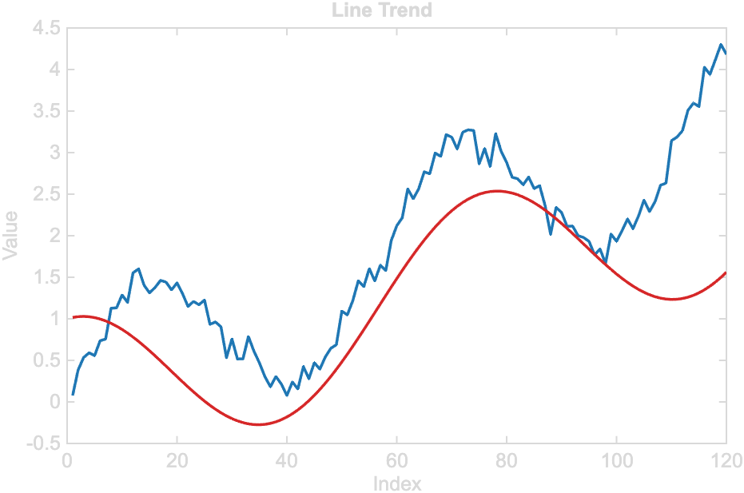 | 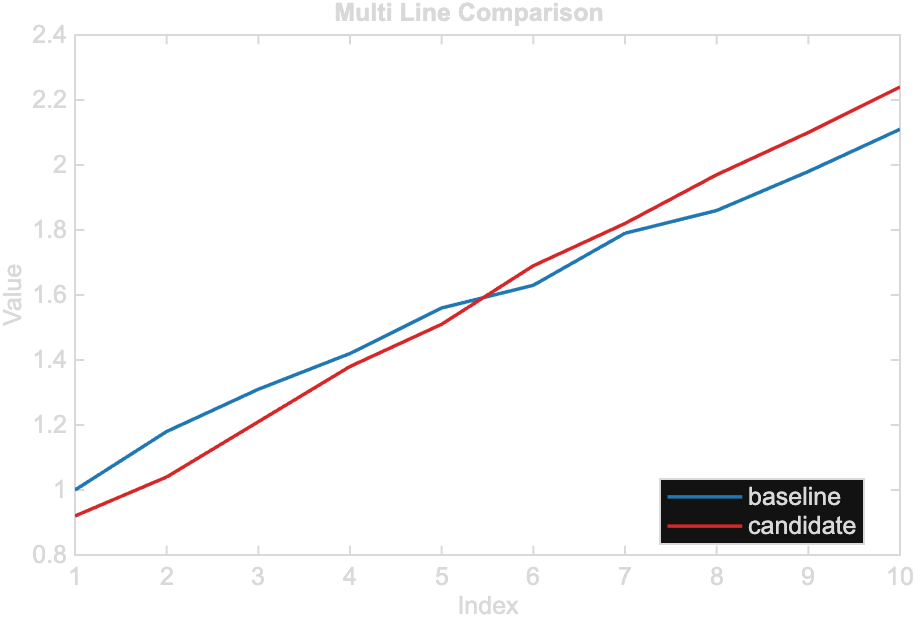 | 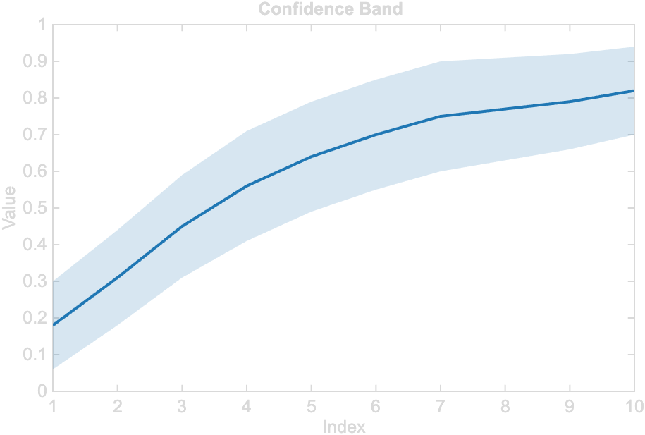 |

| 局部放大 | 散点关系 | 密度散点 |
|---|---|---|
| 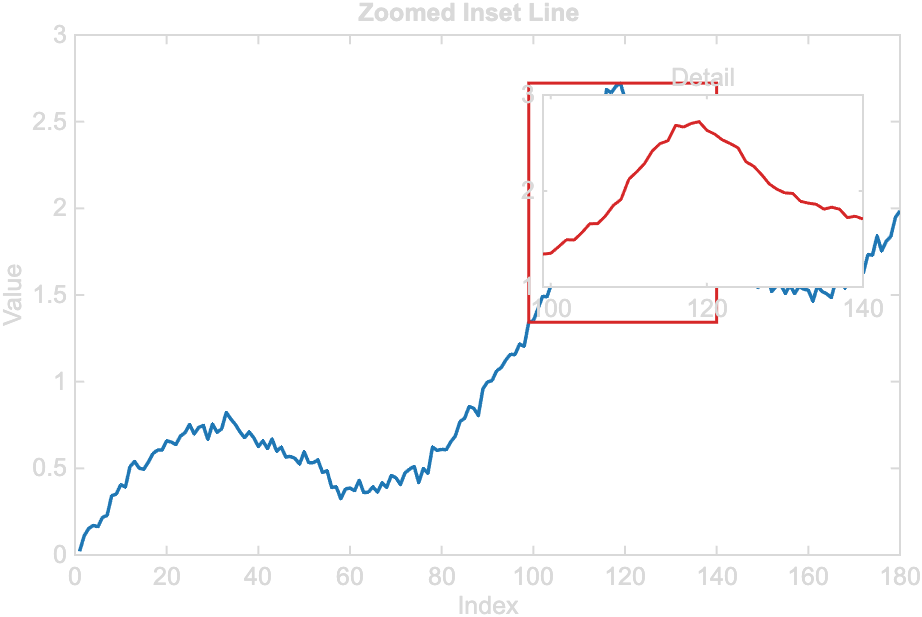 | 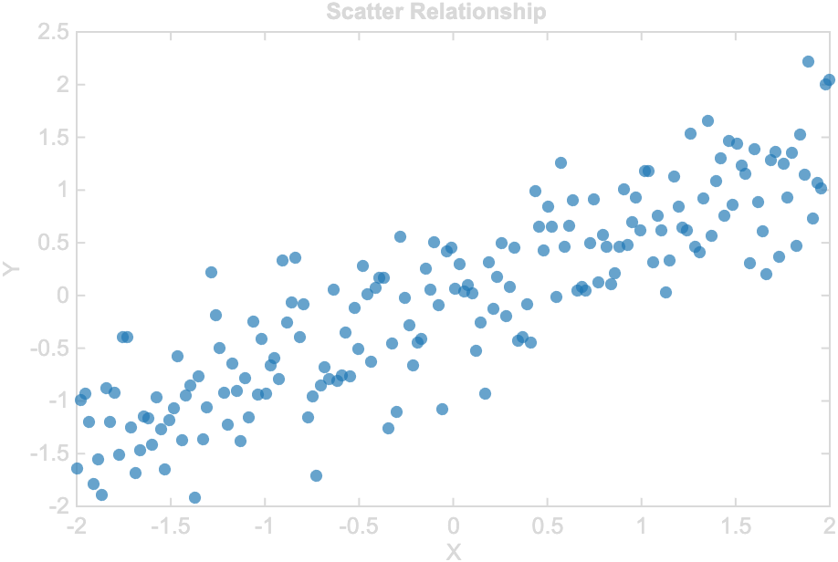 | 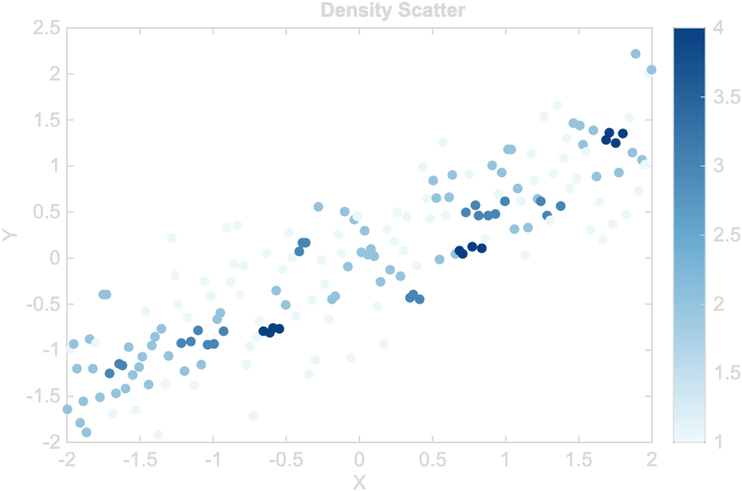 |

| 分组散点 | 等高线散点 | 回归散点 |
|---|---|---|
| 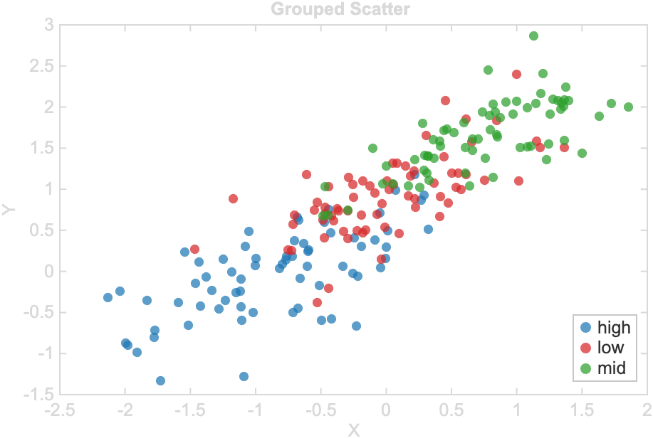 | 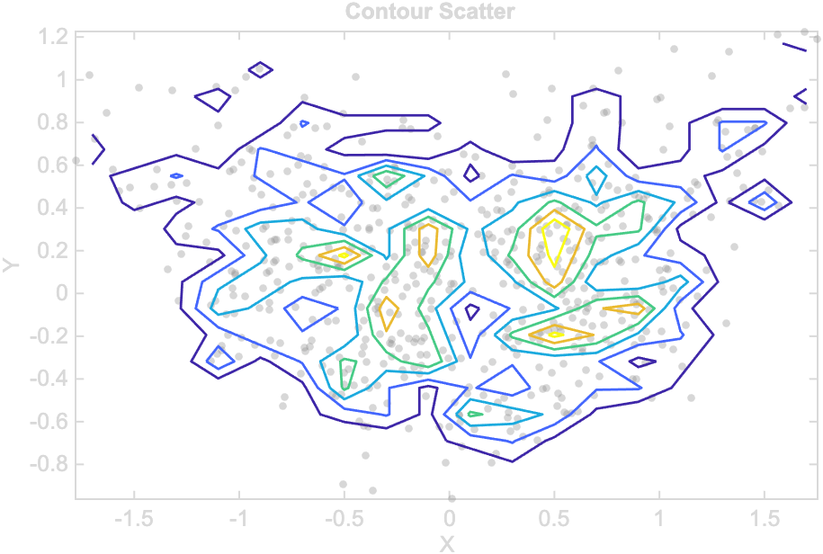 | 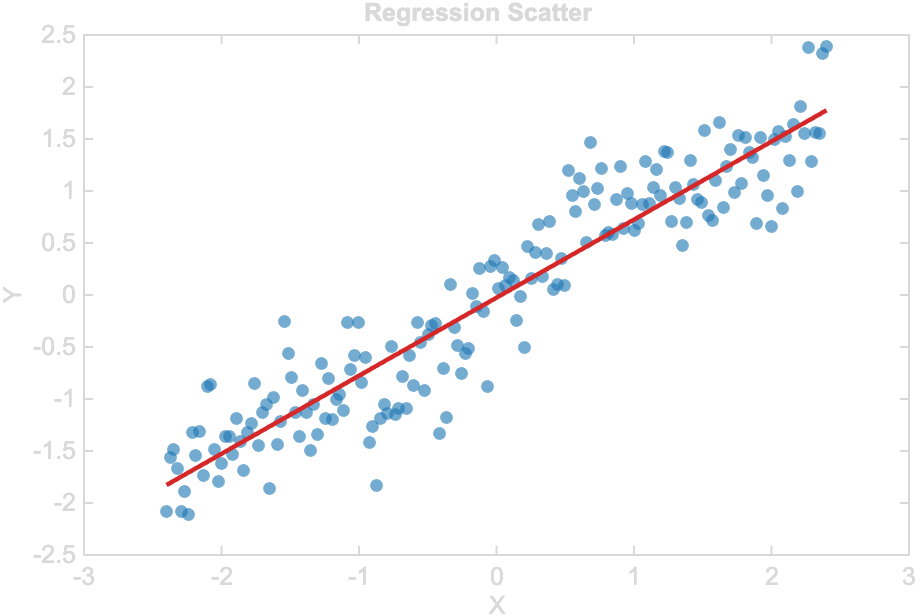 |

| 气泡散点 |
|---|
| 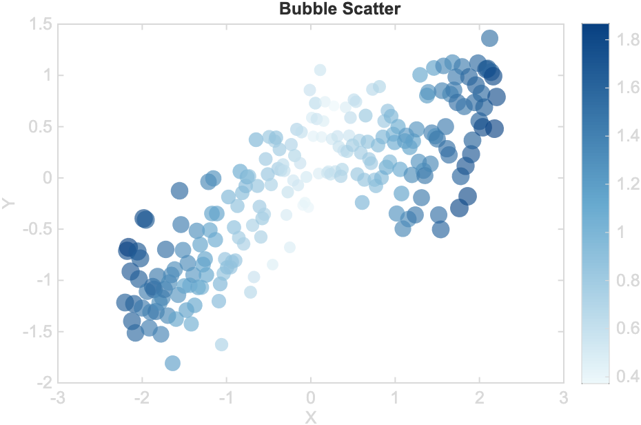 |

| 热图 | 分组柱状 | 正负面积 |
|---|---|---|
| 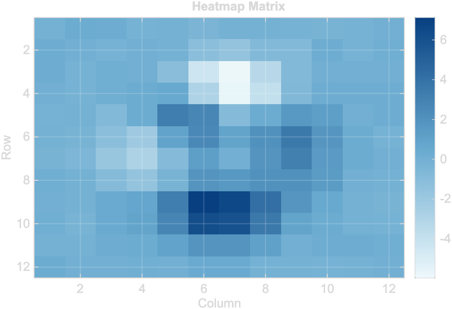 | 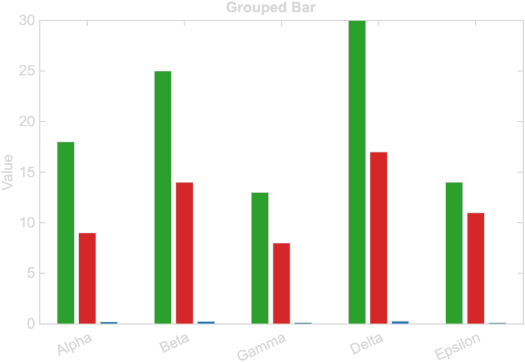 | 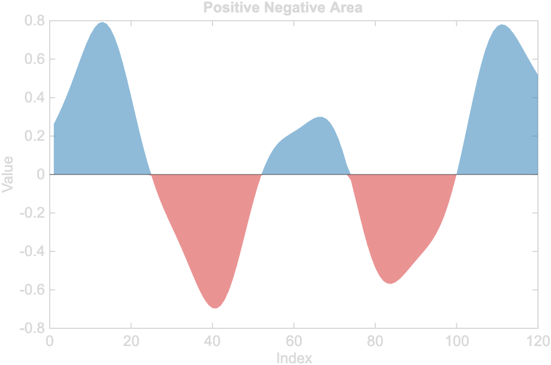 |

| 分段趋势 | 堆叠时间序列 |
|---|---|
| 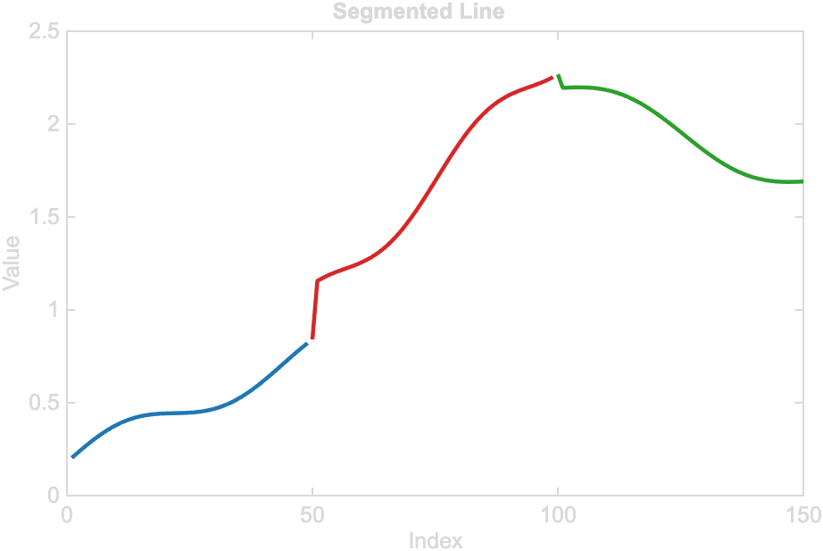 | 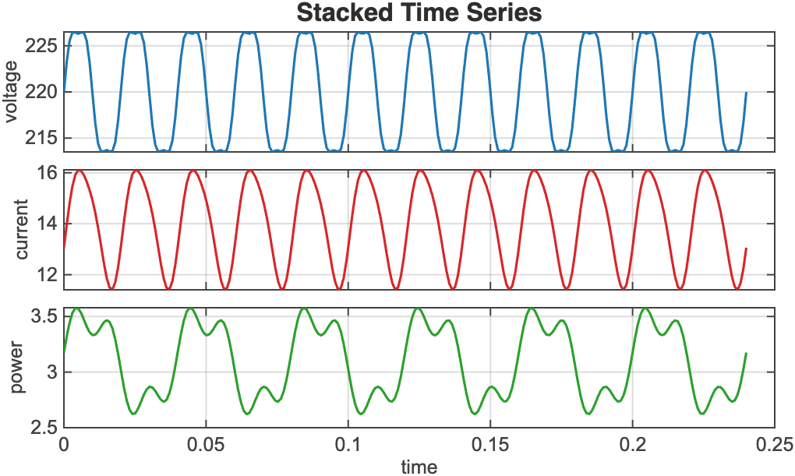 |

## 安装

把 Skill 安装到你实际使用的 agent 运行环境。默认仍然面向 Codex，
也可以显式安装到 Claude Code 或某个项目自己的 skills 目录：

```bash
./scripts/install_skill.sh
./scripts/install_skill.sh --target claude-code
./scripts/install_skill.sh --target dir --path ./skills
./scripts/install_skill.sh --skill scientific-diagram-skill --target dir --path ./skills
```

先预览安装目标：

```bash
./scripts/install_skill.sh --target claude-code --dry-run
```

不同目标对应的路径、复制/软链接区别和检查命令见
[`docs/install-targets.md`](docs/install-targets.md)。

然后可以让你的 agent 执行类似任务：

```text
用我的 CSV 选择一种适合比较方法效果的 MATLAB 图。
从这个 Excel 表生成相关性图。
检查这个 MAT 文件适合画什么图，并导出 PNG/SVG。
先用 Mermaid 梳理我的方法流程，再做一个可编辑的 draw.io 图。
检查这张实验流程图，看看能不能放进 README 或论文补充材料。
```

第一次使用建议从 [`docs/first-render-walkthrough.zh-CN.md`](docs/first-render-walkthrough.zh-CN.md) 开始。它会带你完成 MATLAB 设置、数据检查、`--plan-only`、实际渲染、结果检查和反馈草稿生成。英文版见 [`docs/first-render-walkthrough.md`](docs/first-render-walkthrough.md)。

如果你要提交第一次使用反馈，最好附上 MATLAB 版本、运行过的命令、简短的数据结构摘要、选中的 scheme、报告摘要，以及已经脱敏的错误输出。不要直接上传私有数据文件、本地绝对路径或包含个人信息的日志。
渲染前，可以先运行 `./scripts/doctor.sh --out <诊断输出目录>` 做一次 metadata-only 体检，并生成 `first_use_doctor.md/json`。
渲染完成后，可以运行 `./scripts/collect_first_use_feedback.sh --out <渲染输出目录> --doctor <诊断输出目录> --data-shape "<行数/列数/角色摘要>"` 生成一份已经做基础脱敏的 Markdown 反馈草稿，再人工检查后提交到 [first-use feedback 表单](https://github.com/Kkkakania/matlab-plotting-skill/issues/new?template=first_use_feedback.yml)。

如果要把这个仓库作为维护证据使用，请只引用公开可查的内容：当前 commit、`Quality` workflow、`./scripts/release_check.sh`、`render_report.md/json` 摘要、first-use issue，以及已经脱敏的 PR 或 issue 链接。不要把这些材料写成已有用户规模、下载量或外部项目通过保证。

## 前 5 分钟

先用内置数据跑通一遍，再处理自己的私有数据。

1. 不启动 MATLAB，先检查方案目录。

   ```bash
   ./scripts/doctor.sh --out /tmp/matlab-plotting-skill-doctor
   ./scripts/render_with_matlab.sh --list-schemes
   ./scripts/render_with_matlab.sh --list-schemes --status
   ./scripts/render_with_matlab.sh --scheme-info line_trend
   ```

2. 确认 MATLAB CLI 可以调用。

   ```bash
   MATLAB_BIN=/Applications/MATLAB_R2025a.app/bin/matlab ./scripts/render_with_matlab.sh --check
   ```

3. 用内置 CSV 检查数据并生成作图计划。

   ```bash
   MATLAB_BIN=/Applications/MATLAB_R2025a.app/bin/matlab ./scripts/render_with_matlab.sh --inspect-data --data examples/data/time_series.csv
   MATLAB_BIN=/Applications/MATLAB_R2025a.app/bin/matlab ./scripts/render_with_matlab.sh --plan-only --data examples/data/time_series.csv --goal "show a time trend"
   ```

4. 渲染到临时目录。

   ```bash
   MATLAB_BIN=/Applications/MATLAB_R2025a.app/bin/matlab ./scripts/render_with_matlab.sh --data examples/data/time_series.csv --goal "show a time trend" --out /tmp/matlab-plotting-skill-first-render --formats png,svg
   ```

这个仓库不使用 `SFT_OUTPUT_DIR`。请通过 `--out <directory>` 指定输出目录。

更多内置测试数据见 [`docs/first-five-minutes.md`](docs/first-five-minutes.md)，包括 `multi_series.csv`、`confidence_band.csv` 和 `method_scores.csv`。

## CLI 用法

### 先检查元数据

这些命令不需要 MATLAB：

```bash
./scripts/render_with_matlab.sh --list-schemes
./scripts/render_with_matlab.sh --list-schemes --status
./scripts/render_with_matlab.sh --list-schemes-json --status
./scripts/render_with_matlab.sh --scheme-info line_trend
./scripts/render_with_matlab.sh --scheme-info line_trend --status
./scripts/render_with_matlab.sh --scheme-info-json line_trend
./scripts/render_with_matlab.sh --scheme-info-json line_trend --status
```

如果 MATLAB 不在 `PATH`，可以手动指定：

```bash
export MATLAB_BIN=/Applications/MATLAB_R2025a.app/bin/matlab
./scripts/render_with_matlab.sh --check
```

在 Windows Git Bash 里，路径通常要写到 `matlab.exe`，并且给 `Program Files`
加引号：

```bash
MATLAB_BIN="/c/Program Files/MATLAB/R2024b/bin/matlab.exe" ./scripts/render_with_matlab.sh --check
```

MATLAB 相关命令默认有 600 秒超时保护。`--smoke-test` 会根据 catalog 里的 scheme 数自动扩展预算，并在启动 MATLAB 前打印本次使用的预算。长时间本地渲染时，可以设置：

```bash
export MP_MATLAB_TIMEOUT_SECONDS=0
```

### 哪些命令需要 MATLAB

| 不需要 MATLAB | 需要 MATLAB |
|---|---|
| `--list-schemes` | `--check` |
| `--list-schemes-json` | `--inspect-data --data <file>` |
| `--scheme-info <name>` | `--plan-only --data <file> --goal "<text>"` |
| `--scheme-info-json <name>` | `--smoke-test` |
|  | 使用 `--data`、`--goal` 和 `--out` 的完整渲染 |

### 从数据渲染

```bash
./scripts/render_with_matlab.sh --data examples/data/time_series.csv --goal "show a time trend" --out figures --formats png,svg
```

`--formats` 支持 `png`、`svg` 和 `pdf`，多个格式用逗号分隔。非法格式会在 MATLAB 启动前失败。

只检查数据结构：

```bash
./scripts/render_with_matlab.sh --inspect-data --data examples/data/time_series.csv
```

JSON 里会包含 `RoleHint` 和 `NextCommandHint`。前者说明数据大概像什么，后者给出下一步可以尝试的 `--plan-only` 命令，并避免写入完整本地绝对路径。

只生成方案，不渲染：

```bash
./scripts/render_with_matlab.sh --plan-only --data examples/data/time_series.csv --goal "show a time trend"
```

用更适合人阅读的方式解释为什么选择这个图：

```bash
./scripts/render_with_matlab.sh --explain --data examples/data/time_series.csv --goal "show a time trend"
```

指定某个图形方案：

```bash
./scripts/render_with_matlab.sh --data examples/data/method_scores.csv --scheme grouped_bar --out figures --formats png,svg
```

使用 `--scheme` 会跳过自动规划，适合你已经知道要用哪个图形方案的情况。如果希望 Skill 根据数据和目标来选择，就只写 `--goal`，不要同时写 `--scheme`。

如果你要用脚本读取 JSON 输出，请先看 [`docs/cli-output-contract.md`](docs/cli-output-contract.md)。这里说明了 `schema_version`、catalog 字段、readiness 字段、`--plan-only` 输出和 `render_report.json` 的稳定边界。

MAT 文件里有多个变量时，请明确指定变量名：

```bash
./scripts/render_with_matlab.sh --data data/results.mat --var matrixData --goal "matrix heatmap" --out figures --formats png
```

## 方案覆盖

目录中包含 51 个绘图方案，覆盖趋势、关系、热图、柱状、分布、排名、组成、多变量和论文排版等场景。

建议优先使用 [`docs/scheme-readiness.md`](docs/scheme-readiness.md) 中标记为 `gallery-backed` 的方案。它们已经具备预览图、数据契约、CLI 覆盖、PNG/矢量检查、报告和安全检查。仍处于 `cataloged-only` 的方案是设计目标，不应当被当作完整可用功能宣传。

相近图形会共享参数化 renderer，这样仓库更容易维护，也不容易变成不可控的模板堆。

长期任务板见 [`docs/500-task-plan.md`](docs/500-task-plan.md) 和 [`docs/500-task-board.md`](docs/500-task-board.md)。它们用于规划 51 个方案的逐步完善，不代表每完成一行就发布一个版本。

## 发布状态

当前公开版本线是 `v0.1.x`。早期标签主要用于搭建 scheme catalog、预览 gallery、任务板和 release gate。后续 release 会放慢节奏，优先围绕用户可见的改动合并发布，例如新增稳定 gallery-backed 方案、改进 CLI/报告字段、修复 renderer 行为，或优化第一次使用流程。

维护节奏见 [`docs/maintenance-cadence.md`](docs/maintenance-cadence.md)。这个项目不追求夸大采用量，也不会用频繁小 release 制造活跃感。

## 质量检查

运行普通发布检查：

```bash
./scripts/release_check.sh
```

在有 MATLAB 的机器上运行完整检查：

```bash
MATLAB_BIN=/Applications/MATLAB_R2025a.app/bin/matlab ./scripts/release_check.sh --with-matlab
```

GitHub Actions 会检查打包、文档、manifest、隐私、来源和 MATLAB wrapper。Hosted Linux runner 不会真正渲染 MATLAB 图；涉及 renderer 的改动仍需要在本地 MATLAB 上跑完整检查。

## 重要文档

- [`docs/first-use-doctor.md`](docs/first-use-doctor.md)：渲染前的 checkout 体检。
- [`docs/troubleshooting.md`](docs/troubleshooting.md)：第一次渲染失败、MATLAB 路径异常或选图不合理时先看这里。
- [`docs/first-render-walkthrough.zh-CN.md`](docs/first-render-walkthrough.zh-CN.md)：中文第一次渲染流程。
- [`docs/first-render-walkthrough.md`](docs/first-render-walkthrough.md)：英文第一次渲染流程。
- [`docs/chart-selection-guide.md`](docs/chart-selection-guide.md)：如何按研究任务选图。
- [`docs/selection-algorithm.md`](docs/selection-algorithm.md)：选择算法和解释字段。
- [`docs/activation-contract.md`](docs/activation-contract.md)：Agent 什么时候应该优先或暂缓使用这个 MATLAB Skill。
- [`docs/cli-output-contract.md`](docs/cli-output-contract.md)：CLI 和 JSON 输出契约。
- [`docs/figure-quality-checklist.md`](docs/figure-quality-checklist.md)：论文图质量检查清单。
- [`docs/private-data-handling.md`](docs/private-data-handling.md)：提交反馈前如何处理私有数据。
- [`docs/scheme-readiness.md`](docs/scheme-readiness.md)：当前方案成熟度。
- [`docs/palette-accessibility-notes.md`](docs/palette-accessibility-notes.md)：配色和可访问性说明。
- [`docs/ecosystem-status.md`](docs/ecosystem-status.md)：三个仓库的角色和边界。
- [`docs/writing-style.md`](docs/writing-style.md)：README、入门指南和 Skill 文案的维护者口吻规则。
- [`docs/maintenance-cadence.md`](docs/maintenance-cadence.md)：issue、批量维护和 release 节奏。
- [`ROADMAP.md`](ROADMAP.md)：当前路线图和非目标。

## 来源与安全

所有 MATLAB 代码都是为本仓库 clean-room 编写的。公开仓库不包含加密 `.p` 文件、原始 MAT 数据集、FIG 文件、文档包、论文截图或私有本地路径。生成报告只保存输入和输出文件名，不记录绝对本地路径。

维护和贡献说明见 [`CONTRIBUTING.md`](CONTRIBUTING.md)、[`SECURITY.md`](SECURITY.md) 和 [`CHANGELOG.md`](CHANGELOG.md)。
